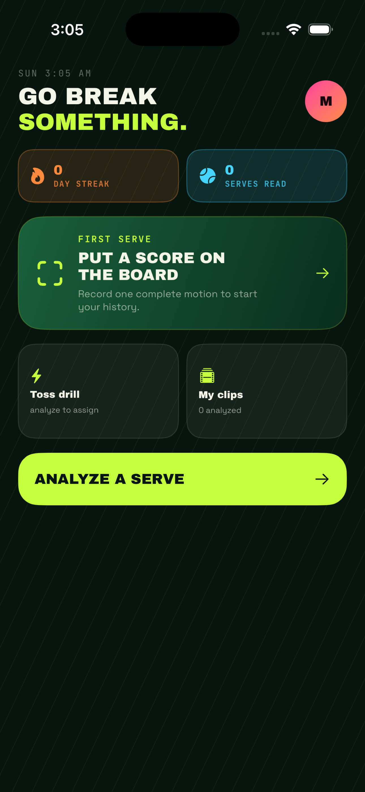

# ServeAI

ServeAI is a native iPhone MVP for recording or importing one tennis serve and receiving structured, confidence-aware coaching feedback. It is built with SwiftUI, MVVM, AVFoundation, PhotosPicker, Apple Vision, Swift Charts, SwiftData, and async/await.


<p align="center">
  
</p>

## Validation snapshot

- Generic-device iOS Release build succeeds with store validation enabled.
- 129 training, governance, and release tests pass; one hardware-only test is skipped.
- 11 annotation-portal tests pass.
- Release packaging excludes unvalidated and commercially uncleared model artifacts.
- Build 1.0 (1) has been uploaded for internal TestFlight validation.

ServeAI remains a validation beta. The shipping path uses Apple Vision pose
estimation plus transparent geometry and scoring rules; its coaching output is
educational and is not represented as coach-validated biomechanics.

## Requirements

- Xcode 26.6 or newer
- iOS 17.0 or newer deployment target
- A physical iPhone is required to verify camera recording; importing, reports, history, and tests run in Simulator

Open `ServeAI.xcodeproj`, select the **ServeAI** scheme, choose a destination, and run. No third-party dependencies or network services are required.

The public repository intentionally excludes participant videos, extracted
frames, local annotation databases, generated datasets, model artifacts,
signing material, and build products. Those files remain local and are not
required to inspect or build the shipping Vision-based analysis path.

From the command line:

```sh
xcodebuild -project ServeAI.xcodeproj -scheme ServeAI \
  -sdk iphonesimulator \
  -destination 'platform=iOS Simulator,name=iPhone 17 Pro' \
  build CODE_SIGNING_ALLOWED=NO

xcodebuild -project ServeAI.xcodeproj -scheme ServeAI \
  -sdk iphonesimulator \
  -destination 'platform=iOS Simulator,name=iPhone 17 Pro' \
  test CODE_SIGNING_ALLOWED=NO
```

## Analysis modes

All implementations conform to `ServeAnalysisService` and feed the same processing, persistence, and report UI. Every imported or recorded clip now passes through an on-device recording-quality gate before analysis, including in mock mode.

The Home menu also contains **Pilot data capture** for the frozen 300-slot research protocol. Entering a slot locks its camera, skill, resolution, frame rate, participant, and collection cohorts before recording. For the 50 intentional failure slots, a rejected clip can be saved as a clearly marked research sample if it still contains enough authentic single-player pose evidence. That path never generates or displays a score, phase grade, technique correction, coaching priority, or drill, and it never weakens the normal user-facing quality gate.

### Vision mode — default

With no configuration, ServeAI samples the selected video on-device, detects human-body poses with Apple Vision, smooths joint trajectories, anchors phases using documented heuristics, and generates measurements and feedback from the observable motion. Racket drop uses a wrist-depth proxy relative to the hitting shoulder, and pronation uses the post-contact elbow-to-wrist path in the image plane. Both are explicitly reported as limited arm-motion proxies rather than direct racket or axial-rotation measurements. Unobservable phases are removed from score weighting, and racket-head speed is never fabricated.

When Vision returns several bodies in stadium or social-video footage, ServeAI
ranks complete pose candidates by their on-screen geometric scale, joint
coverage, and confidence. A clearly dominant foreground athlete is selected
while small background spectators are ignored. The clip is rejected only when
similarly sized foreground players compete for the athlete track across at
least 25% of sampled frames, with a minimum of three ambiguous frames. Isolated
ambiguous frames are omitted rather than assigned to an arbitrary person.

No setup is needed. The app defaults to Vision mode when `SERVEAI_ANALYSIS_MODE` is absent.

### Mock mode — development and UI testing

Mock mode exercises the entire product flow with realistic sample data. Every processing and report screen explicitly says the result is simulated and does not describe the selected video.

To enable it explicitly:

1. In Xcode, edit the **ServeAI** scheme.
2. Choose **Run → Arguments → Environment Variables**.
3. Add `SERVEAI_ANALYSIS_MODE` with value `mock` and enable it.

### Core ML mode — integration boundary

Set `SERVEAI_ANALYSIS_MODE` to `coreml` only after installing a validated model implementation conforming to `ServeInferenceModel`. The current adapter intentionally throws a visible “model unavailable” error instead of presenting heuristic or sample output as trained-model output. `ServeModelFeatureEncoder` provides a versioned, body-centered pose sequence contract for the first model. Real Vision analyses persist that sequence with the source video's SHA-256 and detector/encoder provenance so later coach labels can be joined to the exact model input.

For research inspection, `mock`, `experimentalcoreml`, and `evaluationcoreml` are Debug-only modes. The Release resolver cannot activate them. The Release target also excludes both the research-only THETIS pseudo-coach model and staged evaluation candidates, then fails packaging if either artifact is found in the built app. For pre-release repeatability testing, use the Debug-only `evaluationcoreml` mode after running `Training/stage_evaluation_candidate.py` with the exact compiled coach model, research artifact, and passing Core ML parity report. The app verifies both staged hashes, labels the report “Evaluation candidate · not released,” and records `validatedReleaseVerified: false`. See [Training/MODEL_RELEASE.md](Training/MODEL_RELEASE.md) for the complete staging, repeatability, evaluation, and signing workflow.

Report confidence is deliberately presented as **video evidence quality**. It measures visibility, Apple Vision pose quality, camera suitability, and usable frames; it is not a probability that a score or coaching priority is correct. The report shows model assurance separately for heuristics, failed experiments, evaluation candidates, and signed validated releases.

## Architecture

The project follows MVVM and keeps business logic out of SwiftUI views:

- `App` — app entry, navigation, dependency assembly
- `Models` — analysis domain, persisted `ServeAnalysis`, clip abstraction, errors
- `Views` — onboarding, home, capture, review, processing, reports, history, progress
- `ViewModels` — navigation, persistence coordination, asynchronous processing state
- `Services` — camera, imports, configuration, analysis service boundary
- `Analysis` — frame extraction, Vision pose detection, smoothing, geometry, heuristics, metrics, scoring, confidence, feedback
- `Persistence` — SwiftData repository protocol and implementation
- `Components` — reusable buttons, score dial, badges, court surfaces, banners, empty states
- `Resources` — mock data, 12-drill local library, and bundled display/body/metadata fonts
- `Utilities` — reusable geometry, font registration, and motion helpers
- `ServeAITests` — calculation, sequencing, selection, and persistence tests

Important replacement boundaries include `ServeAnalysisService`, `RecordingQualityAssessing`, `ServeInferenceModel`, `VideoFrameExtracting`, `PoseDetectionService`, `PoseTrackingService`, `ServePhaseDetecting`, `ServeMetricsCalculating`, `AnalysisConfidenceCalculating`, `ServeFeedbackGenerating`, and `ServeAnalysisRepository`.

## Scoring and confidence

The overall estimate uses the following coaching-category intent: ball toss 20%, loading/trophy 20%, leg drive 15%, racket preparation 15%, contact 20%, and follow-through/balance 10%. The ten-phase implementation distributes those category weights across related phases.

If a phase is not measurable, its weight is removed and the remaining weights are normalized. Missing visibility therefore lowers confidence and creates a limitation; it does not lower the score. The report always calls the score an estimate.

Confidence combines visible-frame coverage, average pose quality, usable-frame ratio, and camera suitability. It is shown as Low, Medium, or High with detailed supporting values and missing areas.

## Local storage and privacy

- Analysis results are stored on-device with SwiftData.
- Imported or recorded clips used by saved analyses are copied to the app's Documents/ServeVideos directory.
- Nothing is uploaded in this MVP.
- Vision observations are processed on-device.
- The app performs no facial recognition and does not identify the player.
- Individual analyses can be deleted from History with the visible delete control or context menu. Deleting the final report that references a clip also removes ServeAI's private video copy; the original in Photos is not changed.
- Coach annotation drafts default to **no research/model-training consent**. A local consent reference is not dataset authorization: preparation, assembly, and training also require separately authorized ECDSA-signed receipts and a complete signed ledger snapshot less than 24 hours old. Consent is bound to the participant, current notice, permitted purposes/data, retention window, and exact source-video fingerprint. A later signed revocation disables the record even after dataset assembly. Video pixels remain on-device unless the user explicitly shares the source separately.
- Independent coach labeling uses separate blind local sessions and annotation-ID export filenames, preventing one coach's draft from overwriting or previewing another coach's decisions.
- Cross-device labeling uses a signed coach-task JSON. The coordinator export binds the frozen capture-plan ID/version/SHA-256, one unique slot and participant pseudonym, the analysis UUID, complete report snapshot, schema-v2 pose sequence, exact source-video SHA-256, task UUID, timestamp, and coordinator pseudonym with an ECDSA P-256 device key kept in Keychain. A coach imports the task and original video separately; ServeAI hashes the video, locks the participant to the signed slot, rejects wrong or duplicate tasks, and opens a blank blind session only after verification. The portal rejects an already-used slot or any mismatch between the slot and its camera, skill, participant, split, or collection cohorts. The schema-v8 annotation retains the signed task and exact coaching-rubric identity. Preparation, assembly, training, conversion, and release evaluation fail closed on capture-plan or rubric substitution. Coach qualification, coordinator authorization, and consent remain separately registry-verified.

## Permission descriptions

The Xcode target generates its Info.plist and includes:

- `NSCameraUsageDescription` — records a tennis serve for on-device movement analysis
- `NSMicrophoneUsageDescription` — preserves recorded audio even though audio is not analyzed
- `NSPhotoLibraryUsageDescription` — lets the user choose a serve video

PhotosPicker itself uses Apple's privacy-preserving picker. Camera and microphone requests occur only when the in-app camera is opened.

## Current limitations

- Phase detection and phase scoring are heuristics, not outputs from a trained tennis model.
- Apple body pose does not detect the racket or ball. Racket-drop and pronation scores are limited wrist/elbow motion proxies; racket-head speed, ball speed, exact toss placement, racket-head depth, and axial forearm rotation remain unavailable.
- A single 2D view cannot recover precise depth, hip/shoulder separation, or out-of-plane rotation.
- Dominant hand is not inferred automatically; the internal coach calibration flow records it explicitly for subgroup evaluation.
- The user confirms the full clip. The `VideoClipSelection` abstraction is ready for start/end trimming, but a frame-accurate editor is not included.
- Video pose overlays are not persisted in this MVP.
- Camera capture must be tested on hardware; Simulator has no live camera.
- Vision can reject videos with sustained ambiguity between similarly sized foreground players, inadequate usable frames, extreme occlusion, poor lighting, unsupported encoding, or incomplete framing. Small background spectators do not cause a multiple-player rejection when one athlete is clearly dominant.
- Intentional failure samples are useful only for training and evaluating rejection/usability. They cannot become technique, phase-timing, or coaching-priority ground truth.
- Technical measurements are coaching estimates, not medical or laboratory biomechanics.

## Tests

The test target covers:

- joint-angle and smoothing geometry
- normalized distance
- unavailable-phase score reweighting
- video-evidence quality thresholds and model-assurance semantics
- serve-phase chronology
- coaching feedback and three-drill maximum
- in-memory SwiftData save, fetch, JSON-backed value retrieval, and delete
- recording-quality pass/reject thresholds, dominant-athlete selection, stadium-spectator filtering, and sustained multiple-person blocking
- model feature schema stability and annotation consent defaults
- signed coach-task round-trip, tamper, wrong-video, and duplicate-import rejection
- production-default and explicit analysis-mode resolution
- quality precision/recall, phase-boundary error, coach-priority agreement, and repeatability metrics

See `PHASE2_ACCURACY.md` for the validation-beta protocol and model acceptance gates.

## Design and accessibility

`PRODUCT.md` documents product strategy and `DESIGN.md` defines the native design system. The interface implements the supplied Claude Design reference as native SwiftUI: a deep court-green canvas, acid-lime primary action, cyan/pink/orange status accents, Archivo Black display type, Space Grotesk body type, and JetBrains Mono metadata. All three families are bundled locally and registered at launch; their SIL Open Font License files live beside the font resources.

Custom type remains tied to Dynamic Type text styles. The app also uses SF Symbols, 44-point minimum controls, text/symbol state labels, VoiceOver descriptions, safe-area-aware navigation, and Reduce Motion-aware progress animation. The reference is intentionally dark-only; foreground and state colors were checked against the dark surfaces rather than inferred from a light theme.
